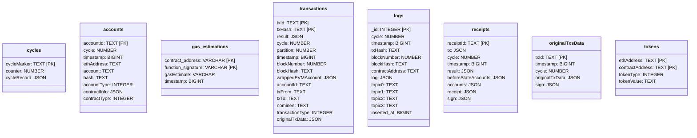

```mermaid
classDiagram
  class cycles {
    cycleMarker: TEXT [PK]
    counter: NUMBER
    cycleRecord: JSON
  }

  class accounts {
    accountId: TEXT [PK]
    cycle: NUMBER
    timestamp: BIGINT
    ethAddress: TEXT
    account: TEXT
    hash: TEXT
    accountType: INTEGER
    contractInfo: JSON
    contractType: INTEGER
  }

  class gas_estimations {
    contract_address: VARCHAR [PK]
    function_signature: VARCHAR [PK]
    gasEstimate: VARCHAR
    timestamp: BIGINT
  }

  class transactions {
    txId: TEXT [PK]
    txHash: TEXT [PK]
    result: JSON
    cycle: NUMBER
    partition: NUMBER
    timestamp: BIGINT
    blockNumber: NUMBER
    blockHash: TEXT
    wrappedEVMAccount: JSON
    accountId: TEXT
    txFrom: TEXT
    txTo: TEXT
    nominee: TEXT
    transactionType: INTEGER
    originalTxData: JSON
  }

  class logs {
    _id: INTEGER [PK]
    cycle: NUMBER
    timestamp: BIGINT
    txHash: TEXT
    blockNumber: NUMBER
    blockHash: TEXT
    contractAddress: TEXT
    log: JSON
    topic0: TEXT
    topic1: TEXT
    topic2: TEXT
    topic3: TEXT
    inserted_at: BIGINT
  }

  class receipts {
    receiptId: TEXT [PK]
    tx: JSON
    cycle: NUMBER
    timestamp: BIGINT
    result: JSON
    beforeStateAccounts: JSON
    accounts: JSON
    receipt: JSON
    sign: JSON
  }

  class originalTxsData {
    txId: TEXT [PK]
    timestamp: BIGINT
    cycle: NUMBER
    originalTxData: JSON
    sign: JSON
  }

  class tokens {
    ethAddress: TEXT [PK]
    contractAddress: TEXT [PK]
    tokenType: INTEGER
    tokenValue: TEXT
  }

```
